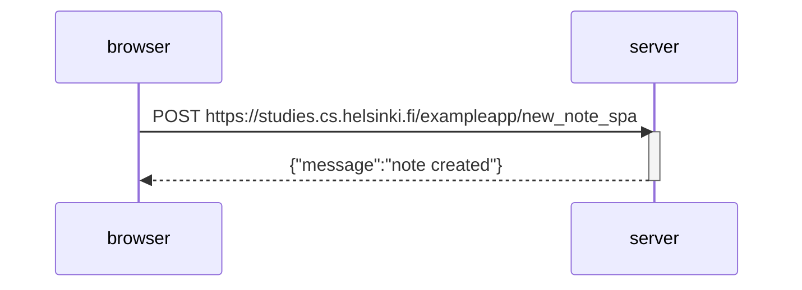

#Part 0
## Assignment 0.4

```mermaid
sequenceDiagram
    participant browser
    participant server

    browser->> server: POST https://studies.cs.helsinki.fi/exampleapp/new_note
    activate server
    server-->>browser: URL redirect
    deactivate server

    browser->>server: GET  https://studies.cs.helsinki.fi/exampleapp/notes
    activate server
    server-->>browser: HTML document
    deactivate server
        
    browser->>server: GET https://studies.cs.helsinki.fi/exampleapp/main.css
    activate server
    server-->>browser: the css file
    deactivate server
    
    browser->>server: GET https://studies.cs.helsinki.fi/exampleapp/main.js
    activate server
    server-->>browser: the JavaScript file
    deactivate server
    
    Note right of browser: The browser starts executing the JavaScript code that fetches the JSON from the server

    browser->>server: GET https://studies.cs.helsinki.fi/exampleapp/data.json
    activate server
    server-->>browser: [{"content":"form data","date":"2023-04-03T07:27:27.585Z"....]
    deactivate server
    
    Note right of browser: The browser executes the callback function that renders the notes
 ```
 
## Assignment 0.5
```mermaid
sequenceDiagram
    participant browser
    participant server

    browser->> server: GET https://studies.cs.helsinki.fi/exampleapp/spa
    activate server
    server-->>browser: HTML Documents
    deactivate server
    
    browser->> server: GET https://studies.cs.helsinki.fi/exampleapp/main.css
    activate server
    server-->>browser: CSS file
    deactivate server
    
    browser->> server: GET https://studies.cs.helsinki.fi/exampleapp/spa.js
    activate server
    server-->>browser: JavaScript file
    deactivate server
    
    Note right of browser: The browser starts executing the JavaScript code that fetches the JSON from the server
    
    browser->> server: GET https://studies.cs.helsinki.fi/exampleapp/data.json
    activate server
    server-->>browser: [{"content":"Testing","date":"2023-04-06T20:19:06.129Z"},...]
    deactivate server
    
    Note right of browser: The browser executes the callback function that renders the notes
```

##Assignment 0.6 


